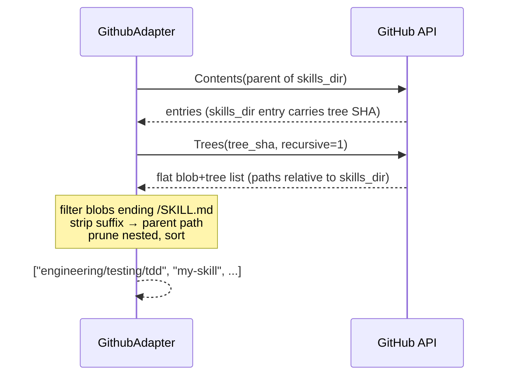

# Design — GitHub nested skill discovery

## Context

`GithubAdapter` (`src/skills_mcp/registries/github.py`) is the only file in scope. It sits at
layer **L2** of the strict `L0 errors → L1 config/auth/cache → L2 registries → L3 dispatch →
L4 server` stack. Caching lives in `CachingRegistry` (L2 decorator); the adapter is a pure
source-fetcher. This change touches **no** config, cache, HTTP adapter, dispatch, or MCP tool
surface — only the three adapter methods (`list_skills`, `fetch_skill`, `fetch_file`) and a new
private helper.

### Current behaviour (verified against code + tests)

| Op | Calls today | Path |
|----|-------------|------|
| `list_skills` | **1** | `Contents(skills_dir)` → return `type=="dir"` entry names, sorted |
| `fetch_skill` | **3** | `Contents(skills_dir)` → find entry `name==skill` → its tree SHA → `Trees(sha, recursive)` → find `SKILL.md` blob → `Blob(sha)` |
| `fetch_file` | **3** | same first two calls → find `file_path` blob → `Blob(sha)` |

Inside `fetch_skill`/`fetch_file` the recursive tree is **rooted at the skill directory**, so
`SKILL.md` sits at tree path `"SKILL.md"` and companions at paths relative to the skill root
(`references/guide.md`). This root-relative framing is the load-bearing invariant that keeps the
change backwards compatible (see §Backwards compatibility).

### Constraint given by the caller

The task brief states an API budget of "≤ 2 per operation". This is **inaccurate for the fetch
operations**, which are 3 calls today and remain 3. See §API call budget and Review Finding R1 —
the honest budget is **list ≤ 2, fetch ≤ 3**. The design meets that; it does not reduce fetch to 2.

## Decision 1 — Resolving a directory path to its tree SHA (`_get_tree_sha_for_dir`)

Both the new `list_skills` (needs the tree SHA of `skills_dir`) and both fetch methods (need the
tree SHA of `{skills_dir}/{skill}`) require the same primitive: *given a repo-relative directory
path, return its Git tree SHA*.

**Chosen approach — Contents-on-parent.** Split the target path into `parent` + `name`; call the
Contents API on `parent`; find the entry with `name == name and type == "dir"`; return its `sha`.
The Contents API entry for a subdirectory already carries its tree SHA (this is exactly what
today's `fetch_skill` reads at line 101). One call, no new endpoint, reuses `_get_contents`.

```
_get_tree_sha_for_dir(path):           # path is repo-relative, no leading/trailing "/"
    parent, name = split_last(path)    # PurePosixPath: parent="skills/a/b", name="c"
    entries = _get_contents(parent)     # 404 → _NotFoundError propagates to caller
    entry = first(e for e in entries if e.name == name and e.type == "dir")
    if entry is None: return None       # caller classifies: skill-not-found vs infra
    return str(entry["sha"])
```

**Alternative considered — whole-repo Trees walk from the ref, filter by `skills_dir/` prefix.**
One call for `list_skills`, but (a) walks the entire repository, inflating truncation risk on large
monorepos, and (b) depends on the Trees API accepting a ref as tree-ish (unverified — see R3).
Rejected: the proposal explicitly scopes the walk to `skills_dir`, and scoping bounds truncation.

### Edge case: `skills_dir` is empty (skills live at repo root)

`skills_dir == ""` has **no parent entry** to read a tree SHA from, so Contents-on-parent cannot
resolve the root tree. `Contents("")` returns the root *listing* (entry SHAs of children) but not
the root *tree* SHA itself. Two ways to obtain the root tree SHA:

- **Option A (1 call): `Trees(ref, recursive=1)`** — pass the configured `ref` directly as the
  tree-ish. Keeps `list_skills` at a single call. **Depends on the Git Trees API accepting a
  branch/tag/commit ref in place of a tree SHA — not asserted here; flagged for verification (R3).**
- **Option B (2 calls, no verification): `Commits(ref)` → `commit.tree.sha` → `Trees(sha)`** — fully
  specified public endpoints, no reliance on ref-as-tree-ish. Keeps `list_skills` within the ≤ 2
  budget.

**Recommendation:** the common, configured case (`skills_dir` non-empty, e.g. `"skills"`) uses
Contents-on-parent and needs no verification. For the empty-`skills_dir` case, use Option A **iff**
R3 is confirmed, else Option B. Either keeps `list_skills` ≤ 2 calls.

## Decision 2 — `list_skills` algorithm

```
tree_sha = tree SHA of skills_dir        # Decision 1 (+ root edge case)
    ─ if not resolvable (404 / missing) → RegistryUnavailableError
      (matches today's "skills_dir not found — check the registry configuration")
entries  = _get_tree_recursive(tree_sha) # existing helper; honours `truncated` warning
candidates = [ e.path[:-len("/SKILL.md")]         # strip suffix → parent dir path
               for e in entries
               if e.type == "blob" and e.path.endswith("/SKILL.md") ]
return sorted(prune_nested(candidates))
```

- Paths are **relative to `skills_dir`**, so a blob at `engineering/testing/tdd/SKILL.md` yields the
  skill name `engineering/testing/tdd`; a flat `my-skill/SKILL.md` yields `my-skill`.
- **`prune_nested` (recommended guard, R4):** drop any candidate that has another candidate as an
  ancestor. A skill that *bundles* a `SKILL.md` as an example companion (e.g.
  `tdd/references/example/SKILL.md`) would otherwise be reported as a phantom second skill *and*
  shadow that file's role as a companion of `tdd`. Pruning keeps the shallowest `SKILL.md` on each
  path. Cost is O(n) over a small set. If deemed YAGNI, document the limitation instead.

## Decision 3 — `fetch_skill` / `fetch_file` algorithm

`skill` is now a slash-delimited path (`engineering/testing/tdd`). The internal tree-filtering is
**unchanged** — only how the skill's tree SHA is obtained changes.

```
_validate_skill_path(skill)              # NEW security guard — see Decision 4
tree_sha = _get_tree_sha_for_dir(f"{skills_dir}/{skill}".strip("/"))
    ─ Contents 404 on the skill's parent, OR entry is None → SkillNotFoundError
      (agent-recoverable: the skill path is wrong)
    ─ but a 404 whose parent == skills_dir itself → RegistryUnavailableError
      (config-level: skills_dir missing — preserves today's classification)
tree_entries = _get_tree_recursive(tree_sha)
# from here IDENTICAL to today:
#   fetch_skill: find blob path=="SKILL.md" → Blob; companions = other blobs, sorted
#   fetch_file:  find blob path==file_path (≠ "SKILL.md") → Blob
```

### Error-handling matrix (fetch)

| Situation | Raise | Class |
|-----------|-------|-------|
| `skill` contains `..` / absolute | `PathTraversalError` | model-recoverable (no I/O) |
| Skill's parent dir missing (404, parent deeper than `skills_dir`) | `SkillNotFoundError` | model-recoverable |
| Parent listed but skill entry absent | `SkillNotFoundError` | model-recoverable |
| `skills_dir` itself 404 (parent == `skills_dir`) | `RegistryUnavailableError` | infra |
| Skill dir has no `SKILL.md` blob | `SkillNotFoundError` | model-recoverable |
| `file_path` not in tree | `SkillFileNotFoundError` | model-recoverable |
| Blob/tree SHA 404, network, rate-limit | `RegistryUnavailableError` | infra |

The classification rule "404 on `skills_dir` itself = infra, 404 deeper = skill-not-found" keeps the
existing flat-repo taxonomy intact while giving nested typos an agent-recoverable error.

## Decision 4 — Security: validate the nested `skill` path (Review Finding R2)

Today `skill` is a single directory name with no separators, so it needs no traversal guard — only
`file_path` is validated. Making `skill` a slash-delimited, agent-supplied path **introduces a new
traversal vector**: `_get_tree_sha_for_dir("skills/../secrets")` would call `Contents("skills/..")`
and could escape `skills_dir` into other parts of the repo. The registry allow-list bounds access to
a *repo*, but not to `skills_dir` within it.

**Mitigation:** before building the path, normalise and reject `skill` with the same logic as
`_validate_file_path` — reject empty, absolute, and any `..` segment that escapes the root. Reuse the
existing normalisation (extract the shared check rather than duplicate it). This is defence-in-depth
and cheap; it must not be omitted.

## Backwards compatibility

Flat repos return **identical** results because:

1. **`list_skills`** — a flat skill `my-skill/SKILL.md` has tree path `my-skill/SKILL.md` (relative
   to `skills_dir`), which ends `/SKILL.md`; stripping the suffix yields `my-skill`. Same names,
   same `sorted()`. (Note: today's list returns *every* subdirectory that is a `dir`; the new list
   returns only subdirectories that actually contain a `SKILL.md`. A stray non-skill subfolder that
   today appears in the list would no longer appear — this is a **behaviour refinement**, arguably a
   fix, but call it out in the spec delta. See R5.)
2. **`fetch_skill` / `fetch_file`** — for a flat skill, `_get_tree_sha_for_dir("skills/my-skill")`
   calls `Contents("skills")` — the *same URL* as today — and reads the same entry SHA. The tree is
   still rooted at the skill dir, so `SKILL.md` and companion paths are byte-for-byte the same. The
   existing `test_adapters.py` fixtures (`_skills_dir_response`, `_skill_tree_response`) remain valid.

## API call budget

| Op | Today | After (flat) | After (nested) | After (`skills_dir==""`) |
|----|-------|--------------|----------------|--------------------------|
| `list_skills` | 1 | 2 | 2 | 2 (Opt B) or 1 (Opt A) |
| `fetch_skill` | 3 | 3 | 3 | 3 |
| `fetch_file` | 3 | 3 | 3 | 3 |

`list_skills` rises from **1 → 2** (a Contents call to resolve the `skills_dir` tree SHA, then the
recursive Trees walk). Fetch operations are **unchanged at 3**. The brief's "≤ 2 per operation" holds
only for `list_skills`; the accurate, met budget is **list ≤ 2, fetch ≤ 3**.

## Edge cases

| # | Case | Behaviour |
|---|------|-----------|
| 1 | Empty `skills_dir` (repo root) | Decision 1 root path — Option A/B; keeps ≤ 2. |
| 2 | Skill nested at exactly 1 level (flat) | `my-skill/SKILL.md` → `my-skill`. Backwards compatible. |
| 3 | Skill nested > 1 level | `a/b/c/SKILL.md` → `a/b/c`. Fetch resolves `Contents("skills/a/b")`. |
| 4 | No skills found | No blob ends `/SKILL.md` → `list_skills` returns `[]`. |
| 5 | `SKILL.md` directly at `skills_dir` root | Tree path is `SKILL.md` (no `/`) → does **not** match `/SKILL.md` → **excluded**. Its parent would be `""` (empty, unfetchable skill name). Excluding preserves today's "subdirectory-only" semantics; log at DEBUG so it is not silently dropped. |
| 6 | `SKILL.md` bundled inside a skill's companions | `prune_nested` drops the deeper candidate (R4); the file remains a companion of the outer skill. |
| 7 | Trees response `truncated` | Existing warning fires; in `list_skills` context it now means *skills* may be missing, not just companions — reword the log (R6). |
| 8 | Parent Contents listing > 1000 entries | Parent page truncated by GitHub's Contents cap could hide the `skills_dir`/skill entry (rare). The old `_CONTENTS_TRUNCATION_WARNING` on `skills_dir` no longer applies to the listing; truncation risk moves to the parent lookup and the Trees `truncated` flag. |

**Decision on case 5:** exclude. Rationale — an empty skill name is not addressable by `get_skill`,
and skills have always been *subdirectories* of `skills_dir`, never `skills_dir` itself.

## Resilience & failure modes

- **Blast radius:** contained to one registry — a tree/blob failure raises `RegistryUnavailableError`
  caught at the tool boundary and returned as an error string; other registries are unaffected
  (existing L4 behaviour, unchanged).
- **New failure mode:** an extra Contents call in `list_skills` is one more point that can 404 /
  rate-limit. Reuses `_request_with_retry`, so Retry-After handling and the ≤ 5 s cap already apply.
- **Truncation:** recursive Trees walk scoped to `skills_dir` (not whole repo) bounds truncation risk;
  the existing `truncated` warning surfaces partial results rather than failing silently.
- **Recovery:** all failures are transient-or-config; no persistent state is written on failure
  (cache only stores successful fetches — unchanged).
- **Migration/delta:** no data migration. Behaviour delta is (i) nested skills become discoverable,
  (ii) `list_skills` names become slash-paths for nested layouts, (iii) non-skill subfolders drop out
  of `list_skills` (R5), (iv) `list_skills` cost 1 → 2 calls.

## Call flow (new `list_skills`)



## Component breakdown

| Part | Work kind | Done-criterion |
|------|-----------|----------------|
| `_get_tree_sha_for_dir(path)` helper | Application code (Python) | Returns tree SHA via Contents-on-parent; handles empty-parent (root) case per Decision 1; unit-tested for flat, nested, missing-parent, missing-entry. |
| `_validate_skill_path` (shared with `_validate_file_path`) | Application code | Rejects empty / absolute / escaping `..` `skill` values; shared normalisation not duplicated; unit-tested with traversal payloads. |
| `list_skills` rewrite | Application code | Recursive Trees walk of `skills_dir`; returns sorted slash-path skill names; flat repos identical; `[]` when none; nested-`SKILL.md` pruned; case-5 excluded. |
| `fetch_skill` / `fetch_file` rewrite | Application code | Resolve skill tree SHA via helper; identical downstream tree/blob logic; error matrix honoured. |
| Test suite | Application code (tests) | New scenarios: nested skill, mixed flat+nested `list_skills`, nested `fetch_skill`/`fetch_file`, skill-path traversal rejection, bundled-`SKILL.md` pruning, empty-`skills_dir`; existing flat tests still green. |
| Spec delta | Spec authoring (engineer) | Update `GitHub Registry Adapter` + `List Skills Tool` requirements/scenarios in `openspec/specs/skills-mcp/spec.md` (R5). Engineer authors; **not** written by this design. |
| Docs | Documentation | If any user-facing doc states skills are one-level, update it; else record "no docs affected". |

## Open questions / research needs

- **R3 (blocks only the empty-`skills_dir` Option A):** Does `GET /repos/{o}/{r}/git/trees/{tree_sha}`
  accept a branch/tag/commit **ref** in place of a tree SHA? If yes, empty-`skills_dir` `list_skills`
  is 1 call (Option A); if unverified, use Option B (`Commits(ref)` → `tree.sha`). Not asserted here.
- **R4 (judgment):** Adopt `prune_nested`, or accept phantom skills from bundled `SKILL.md` files and
  document the limitation? Recommended: prune (cheap, prevents a wrong result).
- **R5 (spec):** `list_skills` no longer returns non-skill subdirectories — confirm this refinement is
  intended and capture it in the spec delta.
