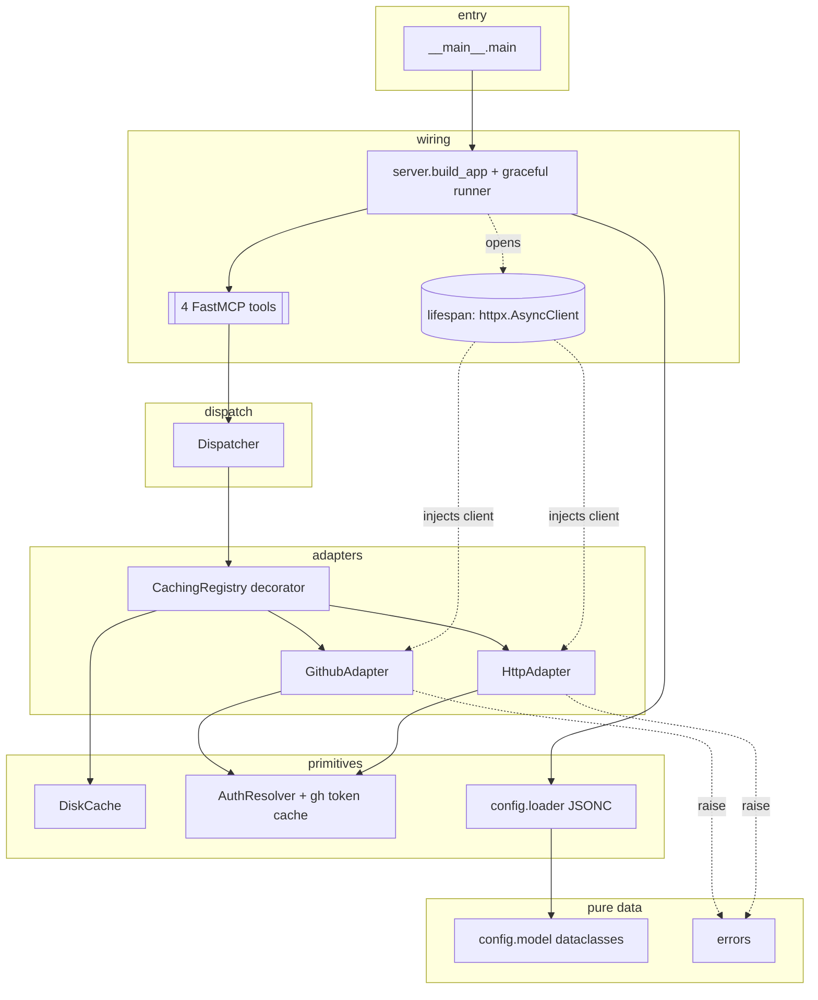
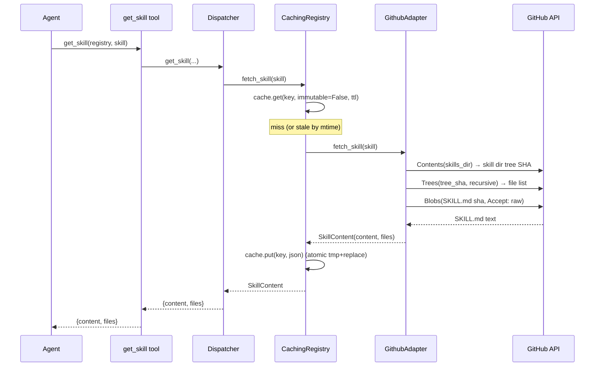

## Context

`skills-mcp` is a Python stdio MCP server that lets agents running inside opencode fetch
skill content (`SKILL.md` and companion reference files) from configurable remote
registries **at runtime**, without ever installing a skill to local disk. It sits beside the
in-repo siblings `md-mcp` and `lsp-mcp` and adopts their house style: `FastMCP` over stdio,
`anyio.run()` + `mcp.run_stdio_async()` SIGTERM-safe shutdown, frozen-dataclass config with a
`sys.exit(1)` fail-fast loader, a dispatch layer between tools and logic, and per-tool error
containment.

This document designs the **component boundaries, module layering, data flow, and the
non-obvious decisions**. It is not an implementation. The confirmed constraints in the brief
(platform/tooling pins, the 4-tool surface, the 2 adapters, auth variants, cache semantics,
the trust and path-safety model, and the v1 non-goals) are treated as **given** — the design
below is the arrangement of components that satisfies them, with options and trade-offs called
out where a genuine choice exists.

### Design priorities (in order)

1. **Resilience** — one registry's upstream failure never crashes the server or leaks into
   another registry; cached immutable content survives upstream outages.
2. **Clarity & simplicity** — a strict, one-directional layering; thin tools; each module owns
   one concern.
3. **Maintainability** — adapters are pure source-fetchers; caching, auth, and dispatch are
   orthogonal and independently testable in-memory.
4. **YAGNI** — the smallest design that meets the brief; every rejected component is recorded.

---

## 1. Module structure & layering

`src/` layout, package `skills_mcp` (matches the confirmed constraint and `md-mcp`):

```
src/skills_mcp/
├── __init__.py
├── __main__.py          # entry point: argparse, stderr logging, build_app → graceful run
├── server.py            # build_app() -> FastMCP; lifespan (httpx client); 4 thin tools;
│                        #   graceful-shutdown runner (md-mcp pattern)
├── dispatch.py          # Dispatcher: registry-name → adapter lookup; the 4 operations
├── errors.py            # exception taxonomy (ValueError subclasses + infra error type)
├── cache.py             # DiskCache: key scheme, atomic write, TTL/immutability
├── auth.py              # AuthResolver: env-var lookup, gh-CLI token cache, header assembly
├── registries/
│   ├── __init__.py      # RegistryAdapter protocol; SkillContent; build_adapters() factory;
│   │                    #   CachingRegistry decorator
│   ├── github.py        # GithubAdapter (two-phase: tree listing → blob fetch)
│   └── http.py          # HttpAdapter (single SKILL.md URL)
└── config/
    ├── __init__.py      # re-exports load_config, Config
    ├── model.py         # frozen dataclasses (Config, registries, auth, cache)
    └── loader.py        # JSONC read → strip → parse → validate; _fatal/sys.exit(1)
```

### Layering rule (strict, one-directional)

A module may import only from a **lower** layer, never a higher or sibling-with-cycle. This is
the primary maintainability invariant and should be enforced in review (and optionally by a
ruff import-linter rule).

| Layer | Modules | Depends on | Never imports |
|---|---|---|---|
| L0 pure data / errors | `errors`, `config/model` | stdlib only | anything above |
| L1 primitives | `config/loader`, `cache`, `auth` | L0 (+ stdlib, `httpx` types in auth only for headers) | registries, dispatch, server |
| L2 adapters | `registries/*` | L0, L1, `httpx` | dispatch, server |
| L3 dispatch | `dispatch` | L0–L2 | server |
| L4 wiring | `server` | L0–L3, `mcp`, `anyio` | `__main__` |
| L5 entry | `__main__` | `server` | — |

`config/model` holds **no logic** and imports nothing project-local, so every layer can name
its types freely.

---

## 2. Config model

### 2.1 Frozen dataclass hierarchy (`config/model.py`)

All config types are `@dataclass(frozen=True)` (immutable, hashable, matches `lsp-mcp`). Auth is
modelled as a small **tagged union** of frozen dataclasses rather than a dict, so the loader
validates variant-specific fields once and adapters never re-parse.

```
Config
├── registries: dict[str, GithubRegistry | HttpRegistry]   # keyed by name; the allow-list
└── cache: CacheConfig

GithubRegistry   name, owner, repo, skills_dir, ref: str, ref_is_sha: bool,
                 auth: NoAuth | GithubTokenAuth | GhCliAuth, cache_enabled: bool
HttpRegistry     name, url, skill_name, auth: NoAuth | BearerAuth | BasicAuth,
                 cache_enabled: bool

# Auth variants (env-var NAMES only — never secret values)
NoAuth           ()
GithubTokenAuth  env_var: str
GhCliAuth        ()
BearerAuth       env_var: str
BasicAuth        username_env_var: str, password_env_var: str

CacheConfig      enabled: bool = True, dir: Path, ttl_seconds: int = 3600
```

- `ref_is_sha` is computed at load time (`ref` matches `^[0-9a-f]{7,40}$`) and drives the
  immutable-cache path. It is a derived field so the cache layer needs no GitHub knowledge.
- Secrets are **never** stored: auth carries env-var *names*; the value is read at request time
  via `os.environ` (see §3.4). The loader validates the names are non-empty strings.
- `cache.dir` defaults to `~/.cache/opencode/skills-mcp/`; `enabled` is global default-on and can
  be turned off globally (`CacheConfig.enabled`) or per registry (`*.cache_enabled`).

### 2.2 JSONC parsing — comment stripping

**Decision required.** The config path is `~/.config/opencode/skills-mcp.jsonc` (JSONC:
comments, and editor-style trailing commas). The values are dense with URLs (`https://…`,
`git@…`), so a **naive `//`-stripping regex is unsafe** — it corrupts `//` inside string
literals.

| Option | Pros | Cons |
|---|---|---|
| **A. Add a JSON5/JSONC dependency** (`pyjson5`, `json5`) | robust, spec-complete | new runtime dep for a tiny grammar subset; against the lean-dep ethos of the siblings |
| **B. Stdlib string-aware stripper** (small state machine) + `json.loads` | zero deps; isolated in `loader.py`; matches `mistletoe`/`pyyaml`-only sibling footprint | ~40–60 lines to get right; must be unit-tested against the URL/`//`-in-string trap |
| **C. Naive regex strip** | trivial | **rejected** — breaks on `https://` in strings |

**Recommendation: Option B.** A single-pass character scanner that tracks *in-string* state
(respecting `\"` escapes), strips `//` line and `/* */` block comments only when **outside** a
string, and tolerates one trailing comma before `]`/`}`. It lives entirely in `loader.py`, is
covered by table-driven unit tests (URL-in-string, comment-in-string, trailing comma, block
comment), and can be swapped for Option A later at zero blast radius because it is one function
behind `load_config`. This keeps the dependency set to exactly what the brief pins.

### 2.3 Load & validate path (`config/loader.py`)

Mirrors `lsp-mcp`'s `load_config`/`_fatal` shape:

1. Resolve path: `--config` arg → else `$XDG_CONFIG_HOME/opencode/…` → else
   `~/.config/opencode/skills-mcp.jsonc`.
2. Read (missing/unreadable → `_fatal`), strip JSONC comments (§2.2), `json.loads`
   (parse error → `_fatal`).
3. Validate structurally and build the frozen model: top-level must be a mapping; each registry
   must declare a known `type` (`github`|`http`); required fields present; `auth.type` is a known
   variant with its required env-var name(s) present and non-empty; `ttl_seconds` ≥ 0.
4. On **any** fatal error, print `skills-mcp: configuration error: <actionable message>` to
   **stderr** and `sys.exit(1)` — the server never starts on bad config (fail fast, before the
   JSON-RPC handshake).

Config errors are a **startup** concern (exit 1); everything after startup is contained per-tool
(§6).

---

## 3. Registry adapter design

### 3.1 The `RegistryAdapter` protocol (`registries/__init__.py`)

A `typing.Protocol` (structural, not ABC) — the two adapters share no implementation, only a
shape, and Protocol keeps them decoupled and trivially fakeable in tests.

```python
class SkillContent(NamedTuple / frozen dataclass):
    content: str            # raw SKILL.md text
    files: tuple[str, ...]  # companion file paths, relative to the skill root, sorted

class RegistryAdapter(Protocol):
    name: str
    type: str               # "github" | "http"
    ref: str | None         # shown by list_registries; None for http

    async def list_skills(self) -> list[str]: ...
    async def fetch_skill(self, skill: str) -> SkillContent: ...
    async def fetch_file(self, skill: str, file_path: str) -> str: ...
```

Adapters are **pure source-fetchers**: no caching and no dispatch concerns. They raise the
domain errors of §6 (`SkillNotFoundError`, `PathTraversalError`, `UnsupportedOperationError`,
etc.) for model-recoverable conditions and `RegistryUnavailableError` for infra failures. A
shared `httpx.AsyncClient` (owned by the lifespan, §5) is injected at construction.

`build_adapters(config, http_client, auth_resolver) -> dict[str, RegistryAdapter]` constructs one
adapter per configured registry and wraps each in a `CachingRegistry` (§4.4).

### 3.2 GitHub adapter — two-phase fetch (`registries/github.py`)

The GitHub adapter resolves everything against the configured `ref` and structures work as
**directory/tree listing → blob fetch**:

- **`list_skills`** — GitHub Contents API on `skills_dir` at `ref`; keep entries whose
  `type == "dir"`; return their names. Note the **1,000-entry directory cap** (§8) — if the
  listing is truncated, log a warning to stderr; v1 does not paginate the Trees API for this
  (documented limitation, YAGNI).
- **`fetch_skill(skill)`** — obtain the skill directory's tree SHA (the `sha` of the skill's
  entry from the Contents listing), then the **recursive Git Trees API**
  (`/git/trees/{tree_sha}?recursive=1`) to enumerate the whole skill subtree in **one** request.
  From the tree: locate `SKILL.md`, fetch its blob (see below) → `content`; `files` = every other
  `blob` path made relative to the skill root, sorted. Missing dir/`SKILL.md` → `SkillNotFoundError`.
- **`fetch_file(skill, file_path)`** — path-guard first (§3.3), then look up the file's blob SHA
  in the enumerated tree and fetch its blob. Unknown path → `SkillFileNotFoundError`.

**Listing mechanism — decision.** Recursive Trees (1 call) is preferred over a recursive
Contents walk (N calls, one per subdirectory) because skills contain `references/` subtrees;
Trees enumerates them in a single request and yields blob SHAs for direct addressing. Trade-off:
Trees can be *truncated* for very large subtrees — acceptable for skill-sized directories and
noted as an edge case.

**Blob / large-file fetch.** Files are fetched by blob SHA via
`/git/blobs/{sha}` with `Accept: application/vnd.github.raw` (returns raw bytes, supports files
well beyond the Contents API's **1 MB** inline limit — up to 100 MB). This is the uniform fetch
path for both `SKILL.md` and companion files: same auth, same host, no separate
`raw.githubusercontent.com` round trip, and it sidesteps the Contents API's metadata-only
response for >1 MB files entirely.

**Rate limiting.** On `429`/`403` with `Retry-After`, wait **once** up to a small cap
(e.g. ≤ 5 s); if the header requests longer, or a second `429` follows, give up and raise
`RegistryUnavailableError` (→ error string). No exponential backoff, no request queue (YAGNI).
The README documents that unauthenticated access (60 req/hr) is impractical for real use.

### 3.3 Path safety (`fetch_file`)

`file_path` is a **virtual** path inside the skill root (there is no local skill directory), so
the guard is logical, not filesystem-based:

1. Normalise with `PurePosixPath`; reject absolute paths and any path whose `os.path.normpath`
   form begins with `..` or contains a `..` segment that escapes the root.
2. **Defence in depth:** only serve `file_path` if it is present in the skill's enumerated
   `files` set (from the tree). This makes traversal structurally impossible — the server can
   only return blobs it already listed under the skill.

Both checks together mean a malformed or malicious `file_path` yields a `PathTraversalError`
(traversal shape) or `SkillFileNotFoundError` (not in the tree), never a fetch outside the skill.

### 3.4 Auth (`auth.py`)

`AuthResolver.headers_for(auth) -> dict[str, str]`, reading env-var *values* at request time:

| Variant | Header produced |
|---|---|
| `NoAuth` | `{}` |
| `GithubTokenAuth(env_var)` | `Authorization: Bearer <os.environ[env_var]>` |
| `GhCliAuth` | `Authorization: Bearer <cached gh token>` (see below) |
| `BearerAuth(env_var)` | `Authorization: Bearer <os.environ[env_var]>` |
| `BasicAuth(user_env, pass_env)` | `Authorization: Basic <b64(user:pass)>` |

- A missing/empty env-var value is an **infra** failure → `RegistryUnavailableError`
  (`"auth env var X not set"`), contained per tool.
- **`gh_cli` token cache.** `AuthResolver` holds an in-process cached token (single value, guarded
  by an `asyncio.Lock` to avoid concurrent subprocess launches). On cache miss it runs
  `gh auth token` via **async subprocess** (`anyio.run_process` / `asyncio.create_subprocess_exec`),
  caches stdout, and reuses it for the process lifetime. If `gh` is absent or exits non-zero, it
  logs a warning to stderr and **falls back to `NoAuth`** (empty headers) — graceful degradation,
  not a hard failure. The cache is owned by the single `AuthResolver` instance created in
  `build_app`, keeping it testable (no module globals).

### 3.5 HTTP adapter (`registries/http.py`)

- `ref = None`; `list_skills` → `[skill_name]` (the one declared skill).
- `fetch_skill(skill)` — if `skill != skill_name` → `SkillNotFoundError`; GET `url` with the
  configured auth header → `content`; `files = ()` (no directory to traverse).
- `fetch_file(...)` → raises `UnsupportedOperationError` (a `ValueError`), which surfaces to the
  agent as an error string per the tool contract ("`get_skill_file` unsupported for http").
- Auth variants: `NoAuth`, `BearerAuth`, `BasicAuth` (§3.4).

---

## 4. Cache design (`cache.py`)

Default-on, read-through disk cache at `~/.cache/opencode/skills-mcp/`, mode **0700**.

### 4.1 Cache key scheme

Logical key: `{registry}/{ref}/{skill}/{artifact}` where `ref` is the configured ref (github) or
the literal `_http` (http, which has no ref). Three artifact kinds are cached — everything an
adapter fetches from source:

| Operation | Key | Stored form |
|---|---|---|
| `list_skills` | `{registry}/{ref}/__skills.json` | JSON `[name, …]` |
| `fetch_skill` | `{registry}/{ref}/{skill}/__skill.json` | JSON `{content, files}` |
| `fetch_file`  | `{registry}/{ref}/{skill}/{file_path}` | raw text |

### 4.2 Disk layout — decision

| Option | Pros | Cons |
|---|---|---|
| **A. Hashed filenames** (sha256 of key) | collision-free; no sanitising | opaque; undebuggable cache dir |
| **B. Sanitised hierarchical mirror** | human-inspectable; mirrors skill structure | must sanitise each path component (refs like `feature/x` contain `/`) |

**Recommendation: Option B**, percent-encoding each *component* (`registry`, `ref`, `skill`) so a
slash inside a ref/name cannot create stray directories, while the `file_path` component keeps its
internal `/` (mirroring `references/foo.md` as real nested dirs). The cache dir stays a readable
mirror of what was fetched, which is worth the small sanitising step at 0700 exposure.

### 4.3 TTL / immutability & atomic writes

- **Immutable (SHA-locked github refs, `ref_is_sha == True`):** cache **indefinitely** — a hit is
  always fresh.
- **Mutable (branch/tag github refs, all http):** honour `ttl_seconds` (default 3600). Freshness is
  the entry's **file mtime**: a hit is fresh iff `now - mtime < ttl`. Using mtime needs **no
  sidecar metadata** and no clock stored in the payload.
- **Atomic writes:** write to `{target}.tmp-{uuid}` in the same directory, `flush`+`fsync`, then
  `os.replace()` onto the final path (atomic within a filesystem). Parent dirs created with
  `mkdir(parents=True, exist_ok=True)`; the cache root is `chmod 0o700` at first use (defeating
  umask). This is the "advisory atomic write" the non-goals accept in place of multi-process
  locking — a concurrent writer at worst re-fetches and re-replaces; readers always see a complete
  file.

### 4.4 Read-through wrapper (`CachingRegistry`)

A **decorator** implementing `RegistryAdapter` and wrapping a real adapter:

```python
class CachingRegistry:                       # implements RegistryAdapter
    def __init__(self, inner, cache: DiskCache, *, immutable: bool, ttl: int, enabled: bool): ...
    async def fetch_skill(self, skill):
        if not enabled: return await inner.fetch_skill(skill)
        hit = cache.get(key, immutable=immutable, ttl=ttl)
        if hit is not None: return deserialize(hit)
        result = await inner.fetch_skill(skill)      # may raise (not cached)
        cache.put(key, serialize(result))
        return result
```

**Placement decision.** Caching lives in a wrapper adapter, **not** in the Dispatcher and **not**
inside each concrete adapter. Rationale: the concrete adapters stay pure and cache-agnostic
(easy to test against fake HTTP); the Dispatcher stays a pure router; the immutable/ttl knobs come
straight from `GithubRegistry.ref_is_sha` / `CacheConfig`. Errors are never cached — only
successful fetches are written.

---

## 5. Server wiring (`server.py` + `__main__.py`)

### 5.1 `build_app(config_path=None) -> FastMCP`

Follows `lsp-mcp`'s `build_app` shape:

1. `cfg = load_config(config_path)` (exits 1 on bad config).
2. Create the `AuthResolver` and `DiskCache(cfg.cache)`.
3. `lifespan` (async context manager) opens the **single shared** `httpx.AsyncClient`
   (sane connect/read timeouts, redirects off by default), then `build_adapters(cfg, client,
   auth)` → wrap each in `CachingRegistry` → construct `Dispatcher(adapters)`; `yield`; on exit
   `await client.aclose()`. The httpx client is the one resource with real lifecycle, so it
   belongs in `lifespan` (the `mcp-server-dev` guidance), not module scope.
4. Register the **4 tools** as thin async adapters over the Dispatcher, each with an explicit
   `description=` (the model's only contract) and typed args.

```python
@mcp.tool(description="List configured skill registries …")
async def list_registries() -> list[dict]:            # [{name, type, ref?}]
    return dispatcher.list_registries()

@mcp.tool(description="List skill names in a registry …")
async def list_skills(registry: str) -> list[str]: ...
@mcp.tool(description="Fetch a skill's SKILL.md text and its companion file list …")
async def get_skill(registry: str, skill: str) -> dict: ...     # {content, files}
@mcp.tool(description="Fetch one companion file's raw text (GitHub registries only) …")
async def get_skill_file(registry: str, skill: str, file_path: str) -> str: ...
```

Tools contain **no logic** beyond delegation + the error-boundary translation of §6.

### 5.2 Graceful shutdown & entry point

`server.py` also provides the `md-mcp` graceful-shutdown runner: an
`async def _run_with_graceful_shutdown(app)` that installs an `anyio` SIGTERM receiver, runs
`await app.run_stdio_async()` inside a task group, and starts a 1-second `os._exit(0)` watchdog on
SIGTERM so a blocked stdin reader cannot hang the process. `__main__.main()`:

1. `argparse` (`--config`, `--log-level`).
2. `logging.basicConfig(stream=sys.stderr, …)` — **stderr only; zero `print()` to stdout**.
3. `app = build_app(config_path=args.config)`.
4. `anyio.run(_run_with_graceful_shutdown, app)`.

The lifespan context is entered by `run_stdio_async()`, so the httpx client is opened/closed
around the serving loop.

### 5.3 Dispatcher (`dispatch.py`)

Holds `dict[str, RegistryAdapter]` (already cache-wrapped). Each method looks the registry up
(missing → `RegistryNotFoundError`) and delegates:

- `list_registries()` → `[{name, type, ref}]` for each configured registry (pure, no I/O).
- `list_skills(registry)` / `get_skill(registry, skill)` / `get_skill_file(registry, skill, file_path)`
  → look up adapter, `await` the matching adapter method.

---

## 6. Error taxonomy (`errors.py`)

Two contained paths, per the `mcp-server-dev` skill and `md-mcp` precedent:

| Condition | Type | Tool boundary | Agent sees |
|---|---|---|---|
| Unknown `registry` arg | `RegistryNotFoundError(ValueError)` | propagate | `is_error=True` — pick a valid registry |
| Skill not found | `SkillNotFoundError(ValueError)` | propagate | `is_error=True` — recoverable |
| Companion file not in skill | `SkillFileNotFoundError(ValueError)` | propagate | `is_error=True` — choose from `files` |
| Path traversal (`..`/absolute) | `PathTraversalError(ValueError)` | propagate | `is_error=True` |
| `get_skill_file` on http registry | `UnsupportedOperationError(ValueError)` | propagate | `is_error=True` — permanent usage error |
| HTTP error / timeout / network | `RegistryUnavailableError` | **catch → return `"Error: …"`** | error **string** result |
| Rate limit exhausted (`429`) | `RegistryUnavailableError` | **catch → return `"Error: …"`** | error string |
| Auth env var unset / `gh` failure that isn't graceful-fallback | `RegistryUnavailableError` | **catch → return `"Error: …"`** | error string |

Rule of thumb: **model-recoverable → raise `ValueError`** (FastMCP marks `is_error=True`, the model
can adjust its call); **infra failure the model cannot fix → catch and return an error string**
(per-tool containment; the server and every other registry stay healthy). A GitHub `404` on a
skill/dir lookup is translated to `SkillNotFoundError` (recoverable), not an infra string. Errors
are never cached.

---

## 7. Diagrams

### 7.1 Component & layering



### 7.2 `get_skill` — cache miss on a branch-locked GitHub registry



---

## 8. Resilience & failure-mode profile

| Failure | Blast radius | Behaviour / recovery |
|---|---|---|
| Config missing/invalid | whole server | **Fail fast**: `sys.exit(1)` before serving; never starts half-configured. |
| Upstream 5xx / network / timeout | one tool call | Contained → error string; server + other registries unaffected; retryable by agent. |
| Rate limit (`429`) | one registry | Honour `Retry-After` once (≤ cap), else error string; README steers users to auth + SHA pins. |
| Auth env var unset | one registry | Error string (`RegistryUnavailableError`); other registries unaffected. |
| `gh` CLI absent/broken | one registry (gh_cli auth) | Graceful fallback to unauthenticated; warning to stderr; may then hit 60/hr. |
| Upstream outage, SHA-locked ref | one registry | **Immutable cache serves indefinitely** — strongest resilience argument for SHA pinning. |
| Directory > 1,000 entries | one `list_skills` | Truncated listing + stderr warning (documented edge; no pagination in v1). |
| Concurrent cache writers | one key | Atomic `os.replace`; last writer wins; readers never see a partial file. |
| SIGTERM | process | Cooperative anyio shutdown + 1 s `os._exit` watchdog; in-flight `finally` blocks run. |

**Scaling:** a single shared `httpx.AsyncClient` pools connections; all tool bodies are `async`;
the SHA-immutable cache makes hot skills effectively free after first fetch. There is no server
state beyond the disk cache and the in-process gh-token cache, so the process is restart-safe.

---

## 9. YAGNI — rejected / deferred (with reason)

- **LRU / cache size cap** — non-goal; skill content is small; simple unbounded 0700 dir suffices.
- **Multi-process cache lock** — non-goal; atomic temp+rename gives readers consistency; a lost
  race only re-fetches.
- **Per-blob immutability optimisation** (caching branch fetches by content SHA) — extra
  complexity; caching by configured ref + TTL meets the brief. Deferred.
- **ETag / conditional requests** to stretch rate limits — real benefit but not required for v1;
  isolated enough to add later. Deferred, noted in README.
- **Exponential backoff / retry queue** — one `Retry-After`-honouring wait is enough; more is
  premature.
- **In-memory content layer** beyond the gh-token cache — the disk cache is the single cache tier;
  a second tier is unjustified.
- **Trees pagination for >1,000-entry dirs** — edge case; warn + document rather than build.
- **ABC for adapters** — a `Protocol` gives the same contract with less coupling; no shared base
  behaviour exists to inherit.

---

## 10. `pyproject.toml` shape

Mirrors `md-mcp` (confirmed pins) with `httpx` added:

```toml
[build-system]
requires = ["hatchling"]
build-backend = "hatchling.build"

[project]
name = "skills-mcp"
version = "0.1.0"
license = "MIT"
requires-python = ">=3.11"
dependencies = [
    "anyio>=4.0,<5",          # confirmed — matches md-mcp
    "mcp[cli]>=1.27.2,<2",    # confirmed — matches md-mcp
    "httpx>=0.27",            # TARGET — confirm exact floor against current release
]

[project.optional-dependencies]
dev = ["pytest", "pytest-asyncio", "ruff", "mypy"]

[project.scripts]
skills-mcp = "skills_mcp.__main__:main"

[tool.hatch.build.targets.wheel]
packages = ["src/skills_mcp"]

[tool.pytest.ini_options]
asyncio_mode = "auto"
testpaths = ["tests"]
```

Notes: **no JSON5 dependency** (stdlib stripper, §2.2). `gh` CLI and `uv` are external *runtime*
requirements, not Python deps. `anyio` and `mcp[cli]` pins are copied verbatim from the in-repo
`md-mcp` (authoritative house pins); `httpx>=0.27` is a **target to confirm** against the current
release (see §12).

---

## 11. Component breakdown

Work-kind is **application code (Python)** for every module; done-criteria below. No implementing
agent is assigned; this is a design artefact, not a task list.

| Component | What it is | Done-criterion |
|---|---|---|
| `config/model.py` | Frozen dataclass hierarchy + auth union | Types express every registry/auth/cache variant; immutable; no logic. |
| `config/loader.py` | JSONC read/strip/parse/validate → `Config`; `_fatal`/exit 1 | Loads valid JSONC (incl. URLs-with-`//`, comments, trailing comma); every invalid shape exits 1 with an actionable stderr message. Unit-tested against the comment-in-string trap. |
| `errors.py` | Exception taxonomy (§6) | `ValueError` subclasses + `RegistryUnavailableError`; used consistently by adapters. |
| `cache.py` | `DiskCache`: key scheme, atomic write, TTL/immutable, 0700 | Immutable keys never expire; mutable keys expire by mtime+ttl; writes atomic; root is 0700; disabled mode bypasses cleanly. |
| `auth.py` | `AuthResolver`: env-var headers + gh-token cache | Correct header per variant; missing env var → infra error; `gh` async-cached once, absent-`gh` → NoAuth fallback with stderr warning. |
| `registries/http.py` | `HttpAdapter` | `list_skills`→1 name; `fetch_skill` by declared name; `fetch_file`→`UnsupportedOperationError`; 3 auth variants. |
| `registries/github.py` | `GithubAdapter` two-phase | Lists skill dirs; enumerates skill subtree via recursive Trees; fetches SKILL.md + files via raw blobs (>1 MB safe); path-guarded `fetch_file`; honours `Retry-After` once. |
| `registries/__init__.py` | Protocol, `SkillContent`, `CachingRegistry`, `build_adapters` | Read-through wrapper caches only successes; factory wires config→adapters→cache→auth. |
| `dispatch.py` | `Dispatcher` router | Registry lookup (unknown→`RegistryNotFoundError`); 4 delegating methods; `list_registries` pure. |
| `server.py` | `build_app` + lifespan + 4 tools + graceful runner | Tools are thin, explicit `description=`, correct error boundary; single shared httpx client opened/closed in lifespan; SIGTERM watchdog present. |
| `__main__.py` | Entry point | argparse; stderr-only logging; builds app; `anyio.run(_run_with_graceful_shutdown, app)`. |
| `tests/` | In-memory `Client(mcp, raise_exceptions=True)` + unit tests | Cover JSONC edge cases, path traversal, cache TTL/immutability, both adapters against a fake httpx transport, and error-taxonomy routing. |
| `README.md` | User doc | Config schema + example JSONC; SHA-pin recommendation; opencode `mcp` + `permission` gating block; rate-limit/auth guidance. |

Any non-trivial user-facing surface: **none** — this is a headless stdio server; no `ui-designer`
pass required.

---

## 12. Research needs (facts to confirm before implementation)

- **`httpx` version floor** — `httpx>=0.27` is a *target*; confirm the current release and that the
  async `AsyncClient` API used (timeouts, `Accept` headers, streaming for large blobs) is stable in
  the chosen floor. (I cannot fetch PyPI from here.)
- **`mcp[cli]>=1.27.2,<2`** and **`anyio>=4.0,<5`** — taken verbatim from in-repo `md-mcp`; treat as
  confirmed unless the implementer intends a newer floor.
- **GitHub API specifics to verify against current docs at implementation time:** the exact
  `Accept: application/vnd.github.raw` behaviour for `/git/blobs/{sha}`, the Contents-API 1 MB
  inline threshold, the recursive-Trees `truncated` flag semantics, and the 1,000-entry directory
  cap. Design accommodates all four; confirm wire details before coding the GitHub adapter.
