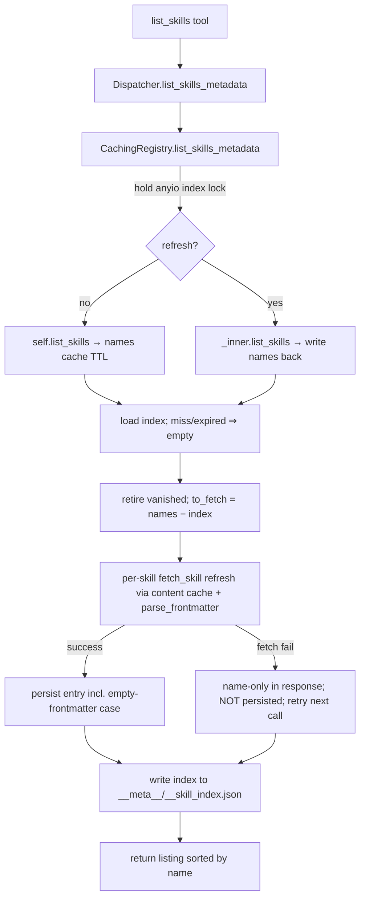

# Design — skill-listing-frontmatter-index

## Context

`list_skills` returns bare skill names. An agent must then issue N `get_skill` calls to
learn which skill fits its task. This change enriches the listing with SKILL.md
frontmatter (`name`, `description`, `tags`, …), backed by a persistent, incrementally
maintained **skill index** in the existing `DiskCache`, and adds a `refresh_cache`
escape hatch to both `list_skills` and `get_skill`.

### Given constraints (settled upstream — designed within, not re-opened)

- No new Python dependencies — frontmatter parsed inline (no PyYAML).
- `list_skills` always returns dicts (not opt-in).
- Skill index stored in `DiskCache`, per `(registry, ref)`, same namespace as existing
  `__meta__` entries.
- `refresh_cache: bool = False` on both tools.

### Verified facts about the current code (design is built on these, not on the brief)

- Cache sentinels live in `cache.py`: `_SKILLS_LIST_FILE = "__skills.json"`,
  `_SKILL_CONTENT_FILE = "__skill.json"`. Names list is keyed
  `(name, ref, "__meta__", "__skills.json")`; per-skill content
  `(name, ref, <skill>, "__skill.json")`. (The brief's `skills_list.json` /
  `skill_content.json` names are inaccurate — use the real constants.)
- `CachingRegistry` derives the ref as `self._inner.ref or "_http"`.
- `DiskCache.get(..., immutable)` skips the mtime-TTL check when `immutable=True`.
  `immutable` is `True` only for GitHub SHA refs (`ref_is_sha`); `False` for branch/tag
  refs and all HTTP registries. `put` is atomic (`os.replace`).
- `GithubAdapter.fetch_skill` costs ~3 upstream calls (Contents-on-parent → recursive
  Trees → Blobs). `list_skills` costs ~2 (Contents-on-parent → recursive Trees).
- The MCP tool surface is **3 tools + 1 resource template**, and the current spec's
  *List Skills Tool* requirement explicitly states "Names only are returned … to avoid
  N+1 upstream API calls." This change **modifies that requirement** (see
  §Behavioural requirements for the engineer).

## Goals / Non-goals

**Goals.** Enrich the listing with frontmatter; avoid the N+1 by caching an index; keep
steady-state listing cheap; give agents a per-call cache-bypass; preserve strict layering
and the "adapters are pure fetchers" invariant.

**Non-goals.** Detecting in-place SKILL.md edits on a *mutable* ref within a TTL window
without a refresh (accepted limitation, §Resilience). Cross-process index locking. A full
YAML parser. Changing the resource template or `get_skill_file`.

## Key design decisions

### D1 — Frontmatter parser: line-oriented, generic capture (Q1)

A `frontmatter.py` module at `src/skills_mcp/frontmatter.py`. It has **no imports from
other project modules**, so it sits below L2 and any layer may call it.

```python
def parse_frontmatter(content: str) -> dict[str, object]:
    """Parse the leading '---' … '---' YAML frontmatter of a SKILL.md.

    Returns a dict of top-level keys. Values are either str or list[str].
    Returns {} when no well-formed frontmatter block is present.
    Never raises: malformed input yields {} or a partial dict.
    """
```

Chosen approach: **line-by-line state machine**, not a whole-block regex. Rationale: a
regex that tolerates quoting, block lists, and colons-in-values becomes unreadable and
fragile; a small line scanner is easier to reason about and to bound.

Grammar subset (everything else is a documented non-goal, skipped silently):

- The block must start on the first non-empty line with a `---` fence and end at the next
  `---` fence. If the opening fence is absent, return `{}`.
- `key: value` — split on the **first** `:`; strip surrounding whitespace from both sides.
- Scalar value unquoting: if the value is wrapped in matching single or double quotes,
  strip them (so a `:` or `#` **inside** the quotes is preserved verbatim). YAML's `''`
  escape for a literal single quote inside single-quoted scalars is honoured.
- Block list: a `key:` with an empty value followed by one or more `  - item` lines
  collects into `list[str]`. Each item is unquoted by the same rule.
- Full-line comments (`#` as the first non-space character) are skipped.
- **Inline** comments are *not* stripped (a `#` mid-value stays part of the value) — an
  explicit non-goal, called out so callers do not expect YAML comment semantics.
- A key whose value is a nested **mapping** (indented `k: v` children) is skipped — the
  parser captures scalars and string-lists only. Non-goal, documented.

Field policy: capture **all** top-level scalar/string-list keys generically (so `license`,
`compatibility`, etc. pass through), not just the three named fields. The consumer decides
what to surface.

### D2 — Index shape, storage, and TTL (Q1 storage, TTL correctness)

New constant in `cache.py`: `_SKILL_INDEX_FILE = "__skill_index.json"`. The index is one
JSON object stored at `(name, ref, "__meta__", "__skill_index.json")` — the same
`__meta__` namespace and the same `immutable` flag as the names list.

On-disk shape:

```json
{ "<skill-identifier>": { "name": "...", "description": "...", "tags": ["..."] }, ... }
```

TTL decision: the index is read and written with the **same `immutable` flag** as every
other entry (`immutable = ref_is_sha`). Consequences, and why this is correct:

- **SHA refs** (`immutable=True`): index never expires — content is genuinely immutable,
  so incremental-by-name is always correct.
- **Branch/tag/HTTP refs** (`immutable=False`): index expires at `ttl_seconds`, in lockstep
  with the names list and per-skill content caches. On expiry the index read misses and a
  full rebuild runs, which is exactly what picks up **in-place edits** to an existing
  skill's frontmatter. This bounds edit-staleness to one TTL window (default 1 h) and keeps
  all cache layers coherent. `refresh_cache=True` is the immediate escape hatch.

This is why the index must **not** be persisted past its TTL for mutable refs: an
edit-in-place changes a skill's frontmatter without changing its identifier, so a
name-only reconciliation can never see it. Tying index lifetime to the existing TTL is the
smallest mechanism that stays correct without threading blob SHAs (rejected under YAGNI —
see §Rejected).

### D3 — Protocol stays minimal; capability added one layer up (Q3)

`RegistryAdapter` (L2 Protocol) does **not** grow `list_skills_metadata`. Building the
index composes `list_skills` + `fetch_skill` + `parse_frontmatter` — an aggregation/caching
concern, not a source-fetch. Adding it to the Protocol would force `GithubAdapter` and
`HttpAdapter` to implement it, breaking "adapters are pure source-fetchers."

Instead, introduce a **narrow structural Protocol** in `registries/__init__.py`:

```python
@runtime_checkable
class MetadataRegistry(RegistryAdapter, Protocol):
    async def list_skills_metadata(self, *, refresh: bool = False) -> list[dict[str, object]]: ...
    async def fetch_skill(self, skill: str, *, refresh: bool = False) -> SkillContent: ...
```

`CachingRegistry` structurally satisfies `MetadataRegistry`. The adapters satisfy only the
base `RegistryAdapter`. `build_adapters` changes its return type to
`dict[str, MetadataRegistry]` (it always yields `CachingRegistry`, so this is a type-level
change only, no runtime change), and `Dispatcher` holds `dict[str, MetadataRegistry]`.
`fetch_skill` gaining a defaulted `*, refresh` keyword remains compatible with the base
Protocol's `fetch_skill(self, skill)`.

### D4 — Dispatcher: distinct method, not an overload (Q4)

Add a separate `Dispatcher.list_skills_metadata(registry, *, refresh=False)` returning
`list[dict]`; keep `Dispatcher.list_skills` (→ `list[str]`) intact for internal reuse and
the names-cache mechanics. Distinct return types make overloading `list_skills` a typing
and readability hazard. Also thread `refresh` into `Dispatcher.get_skill`:

```python
async def list_skills_metadata(self, registry: str, *, refresh: bool = False) -> list[dict[str, object]]:
    return await self._get_adapter(registry).list_skills_metadata(refresh=refresh)

async def get_skill(self, registry, skill, file=None, *, refresh: bool = False) -> SkillContent | str:
    # file is None → fetch_skill(skill, refresh=refresh); file set → fetch_file (unchanged)
```

### D5 — `CachingRegistry.fetch_skill` refresh writes back (Q5)

```python
async def fetch_skill(self, skill: str, *, refresh: bool = False) -> SkillContent:
```

Behaviour: when `refresh` is `False`, unchanged. When `True`, **skip the cache read**,
fetch fresh from `self._inner`, and **write the fresh result back** to
`(name, ref, skill, "__skill.json")`, replacing the stale entry. Writing back (rather than
merely bypassing) is the point: it repairs the cache for every later reader.

### D6 — HTTP registries need no special path (Q6)

`HttpAdapter.list_skills` returns a single declared name and `fetch_skill` is one GET, so a
cold or refreshed index costs one fetch. The same `list_skills_metadata` code path applies.
An HTTP-hosted SKILL.md may legitimately lack frontmatter → `parse_frontmatter` returns
`{}` → a name-only index entry. No branching required.

### D7 — Identifier is authoritative for `name` (disambiguation)

The result dict's `name` is **always the skill identifier** returned by `list_skills`
(what an agent passes to `get_skill`). A frontmatter `name:` field is informational and
must never overwrite the identifier. Merge rule:
`entry = {"name": identifier, **{k: v for k, v in frontmatter.items() if k != "name"}}`.

## The index-update algorithm (Q2, Q7, Q8 — precise)

`CachingRegistry.list_skills_metadata`:

```python
async def list_skills_metadata(self, *, refresh: bool = False) -> list[dict[str, object]]:
```

State per instance (one `CachingRegistry` == one `(registry, ref)`):
`self._index_lock = anyio.Lock()` (constructed in `__init__`; `anyio` per AGENTS.md —
never `asyncio` primitives). The lock serialises index read-modify-write **within this
process**; cross-process safety rests on `DiskCache`'s atomic writes plus the
index-is-rebuildable property (last-writer-wins is self-healing).

Algorithm, executed while holding `self._index_lock`:

1. **Determine the authoritative name set.**
   - `refresh is True`: bypass the names cache — call `self._inner.list_skills()` directly,
     then write the fresh list back to `(name, ref, "__meta__", "__skills.json")` (**Q8:
     yes, write back**). Treat the loaded index as empty (full rebuild).
   - `refresh is False`: call `self.list_skills()` (the caching wrapper — honours the names
     TTL, consistent with existing behaviour). Load the persisted index via
     `self._cache.get(..., "__skill_index.json", immutable=self._immutable)`; a miss
     (absent or TTL-expired) means "rebuild fully" (empty starting index).

2. **Reconcile.** Let `names` = authoritative set, `index` = loaded map.
   - **Retire**: drop every key of `index` not in `names`.
   - **Additions**: `to_fetch = [n for n in names if n not in index]` (on `refresh`,
     `to_fetch == names`).

3. **Fetch additions** (only the missing skills — this is the incrementality). For each
   `n in to_fetch`, call `self.fetch_skill(n, refresh=refresh)` (goes through the
   per-skill content cache, so a genuinely new skill is fetched once and the fetch also
   **warms `__skill.json`** for a later `get_skill`). Then
   `fm = parse_frontmatter(content.content)`; build the entry per D7.
   - Fetch these concurrently with `anyio` task supervision; collect per-skill outcomes so
     one failure cannot abort the batch.

4. **Error handling per skill:**
   - **Fetch failure** (`RegistryUnavailableError`, `SkillNotFoundError`) — *transient/
     structural*: **do not** persist a poisoned entry. Emit a **name-only** entry
     (`{"name": n}`) into the returned list so discoverability is preserved, log a warning,
     and leave `n` absent from the index so the next call retries (**Q2: index persists as
     the successfully-fetched subset; failed new skills are retried, not cached**).
   - **Fetch success, frontmatter empty/malformed** — *deterministic*: `parse_frontmatter`
     returns `{}` or a partial dict; the entry is `{"name": n, …}` and **is persisted**
     (re-fetching would not improve a deterministic parse) (**Q7: present with whatever
     metadata parsed — at minimum the name — never absent**).

5. **Persist.** Write the reconciled index (retained + newly-succeeded entries) to
   `(name, ref, "__meta__", "__skill_index.json")`. Persist the successful subset even if
   some skills failed in step 4 (a partial index is valid and improves the next call).

6. **Return** the full listing (persisted entries ∪ name-only entries for this call),
   sorted by `name` for deterministic output.

Concurrency notes (Q2): the in-process lock prevents lost updates and a concurrent-fetch
storm for the same registry. Two *different* processes may still interleave; because `put`
is atomic and the index is a pure cache, the worst case is a redundant rebuild, never
corruption. The lock is held across the (network) fetch batch — acceptable because it is
per-registry and the alternative (releasing mid-reconcile) reintroduces lost updates; a
second concurrent caller simply waits for the warm index.

## Component breakdown

| Component | Work kind | Done-criterion |
|---|---|---|
| `frontmatter.py` — `parse_frontmatter` | Application code (new module, no project imports) | Parses the D1 subset; returns `{}` on missing/malformed; never raises; unit-tested against quoted scalars, block lists, `:`/`#`-in-quotes, `''` escape, nested-mapping skip, no-fence input. |
| `cache.py` — `_SKILL_INDEX_FILE` constant | Application code | Constant added; no change to `DiskCache` put/get behaviour. |
| `registries/__init__.py` — `MetadataRegistry` Protocol; `CachingRegistry.list_skills_metadata`, `fetch_skill(*, refresh)`, `_index_lock` | Application code | `CachingRegistry` structurally satisfies `MetadataRegistry`; algorithm §Index-update implemented; `build_adapters` return type widened. |
| `dispatch.py` — `list_skills_metadata`; `get_skill(*, refresh)` | Application code | New method routes to adapter; `refresh` threaded to `fetch_skill`; adapter dict typed `MetadataRegistry`. |
| `server.py` — `list_skills` tool rewritten (returns dicts, `refresh_cache` param, updated `description=`); `get_skill` tool gains `refresh_cache` | Application code (MCP tool surface) | Tool returns JSON array of dicts; `RegistryUnavailableError` still caught at boundary; `description=` updated to advertise the new shape and `refresh_cache`; resource template unchanged. |
| Behavioural requirements (below) | Spec authoring — **engineer**, not architect | Delta specs authored under `openspec/changes/.../specs/`. |
| Tests | Application code | Unit tests for parser + index reconciliation (add/retire/refresh, fetch-fail vs parse-fail, TTL-miss rebuild); updated integration tests for the new `list_skills` shape. |

## Behavioural requirements for the engineer (transcribe into delta specs — architect does not write specs)

1. **MODIFIED — List Skills Tool.** `list_skills(registry, refresh_cache=False)` SHALL
   return a JSON array of objects, each with at least `name` (the skill identifier) and,
   when present in SKILL.md frontmatter, `description`, `tags`, and any other top-level
   scalar/string-list frontmatter fields. This supersedes the current "names only … to
   avoid N+1" wording; the N+1 is now avoided by the cached index, not by withholding
   metadata. A skill whose SKILL.md cannot be fetched SHALL still appear as a name-only
   object. Unknown-registry still raises (`is_error=True`).
2. **MODIFIED — Get Skill Tool.** `get_skill` SHALL accept `refresh_cache: bool = False`;
   when `True` and `file` is absent, the SKILL.md SHALL be re-fetched upstream and the
   per-skill cache entry replaced.
3. **NEW — Skill Index capability.** A per-`(registry, ref)` index in the disk cache maps
   skill identifier → parsed frontmatter, incrementally reconciled on each `list_skills`
   call (fetch new, retire deleted), rebuilt on TTL-miss or `refresh_cache=True`.
4. **NEW — Frontmatter Parsing capability.** Inline parsing of the SKILL.md `---` block
   into `{name, description, tags, …}`; graceful `{}` on missing/malformed input; no new
   dependency.

The MCP Tool Surface requirement (three tools + one resource template) is **unchanged**.

## Data / control flow



## Resilience & failure-mode profile

- **One bad skill never fails the listing.** Per-skill fetch/parse failures degrade to a
  name-only entry; the batch and the index persist.
- **Cold start / `refresh_cache=True` cost.** A full build is `list_skills` (~2 calls) +
  N × `fetch_skill` (~3 calls each on GitHub). At ~40 skills that is ~120 upstream calls —
  fine within an authenticated GitHub budget (5000/h) but able to exhaust an
  **unauthenticated** budget (60/h). Blast radius: a single tool call may 429; the existing
  `_request_with_retry` (single Retry-After honour) plus `RegistryUnavailableError` at the
  tool boundary contain it. Mitigation already inherent: steady-state calls fetch **zero**
  blobs (index warm); refresh is opt-in. *If unauthenticated cold-start proves painful, a
  future optimisation is to derive SKILL.md blob SHAs from the single recursive tree walk
  and fetch only blobs (N+1 total) — deliberately out of scope here (YAGNI, needs an
  adapter change).*
- **In-place edits on mutable refs** are invisible to name-only reconciliation until the
  index TTL expires (≤ `ttl_seconds`) or `refresh_cache=True`. Accepted; documented in the
  tool description. SHA refs are immune (immutable).
- **Recovery.** The index is a pure cache: deleting the cache dir, a TTL expiry, or any
  `refresh_cache=True` fully rebuilds it. No migration or persistent state to corrupt.
- **Cross-process races** self-heal via atomic `put` + rebuildable index (last-writer-wins).
- **No stdout writes; failures logged to stderr** — preserves the stdio JSON-RPC framing
  invariant.

## Rejected alternatives

- **Grow `RegistryAdapter` with `list_skills_metadata`** — rejected: forces the pure
  fetchers to implement aggregation; breaks the layering invariant. (D3)
- **Overload `Dispatcher.list_skills`** to return dicts — rejected: two return types on one
  method is a typing/readability hazard. (D4)
- **Persist the index past TTL for mutable refs + detect edits via blob-SHA comparison** —
  rejected under YAGNI: needs blob SHAs threaded through a new adapter surface for a
  correctness case that TTL-bounded rebuild already covers. (D2)
- **Whole-block regex frontmatter parser** — rejected: fragile against quoting, block
  lists, and colons-in-values; the line scanner is smaller and clearer. (D1)
- **Cross-process file locking on the index** — rejected: atomic writes + a rebuildable
  cache make it unnecessary complexity.
- **Add PyYAML** — precluded by the settled no-new-dependency constraint.
